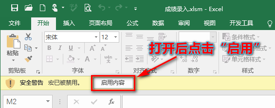
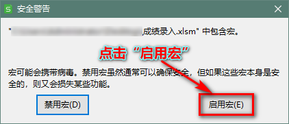
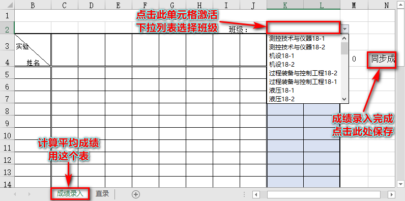
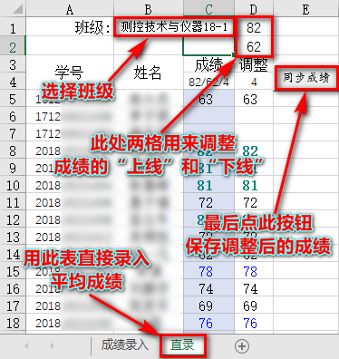
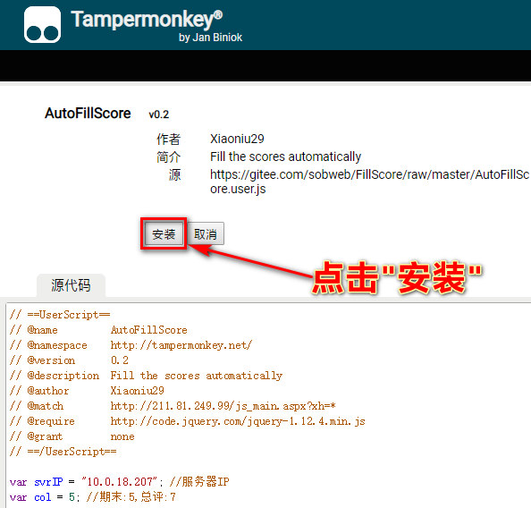
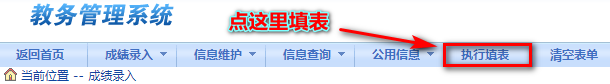

自动填写成绩
===============

使用说明
----------

由Python版REST API服务器和Excel VBA版客户端(ScoreIn.xlsm)以及浏览器端的Greasemonkey(油猴)脚本构成。

**下载** `成绩录入.xlsm <https://gitee.com/sobweb/FillScore/raw/master/成绩录入.xlsm>`_ 

Step 1: Excle操作部分
----------------------

在Excel中计算成绩并提交数据到服务器中的数据库保存

**step 1.1** 用Excel或WPS打开”成绩录入.xlsm", 并“启用宏”。

**step 1.2-1** 录入各实验成绩，得到平均分并保存。

**step 1.2-2** 直接录入平均成绩，调整成绩并保存

Setp 2: 浏览器自动填成绩表
-------------------------

**step 2.1** 浏览器准备

油猴插件请自行在浏览器应用市场搜索关键字 `Tampermonkey` 安装。

`QQ浏览器 <https://pcbrowser.dd.qq.com/pcbrowserbig/qbextension/update/20191117/dhdgffkkebhmkfjojejmpbldmpobfkfo.crx>`_ , `猎豹浏览器 <https://pcbrowser.dd.qq.com/pcbrowserbig/qbextension/update/20191117/dhdgffkkebhmkfjojejmpbldmpobfkfo.crx>`_ , `360浏览器 <http://download.chrome.360.cn/ext/Tampermonkey_4.8.41_dhdgffkkebhmkfjojejmpbldmpobfkfo.crx>`_ 

插件安装完成后, **打开** `脚本地址 <https://gitee.com/sobweb/FillScore/raw/master/AutoFillScore.user.js>`_ 点击“安装“即可。

**Step 2.2** 自动填表

在浏览器中打开 `成绩录入页面 <http://211.81.249.99/default2.aspx>`_ , 由脚本自动填写成绩, 手动保存/提交。

-说明结束-END-
--------------
